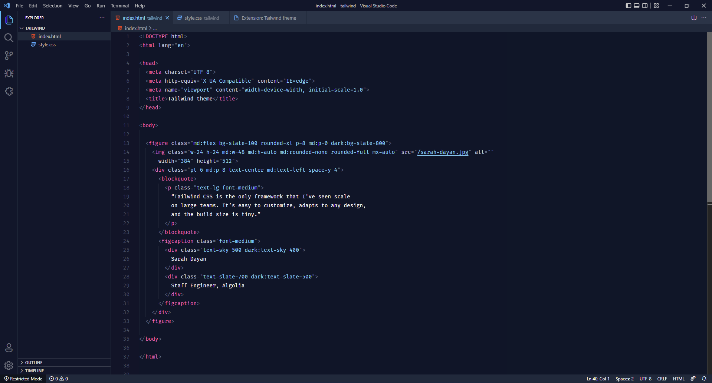
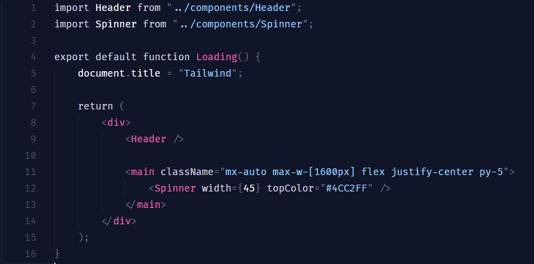
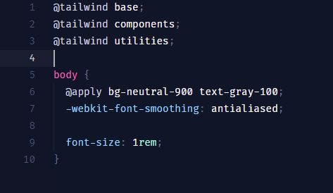

# Tailwind Dark Theme

## Theme made for React, HTML CSS. (NOT OFFICIAL)

* Install Fira Code font. 
* Press `F1` and search for <strong>Preferences: Open User Settings (JSON)</strong>
* With Fira Code installed, insert that JSON settings:

```json
"editor.fontFamily": "Fira Code",
"editor.lineHeight": 24,
"editor.fontSize": 14,
```

<p align="center">



</p>

**Enjoy your theme!**
